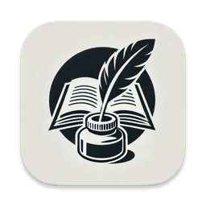
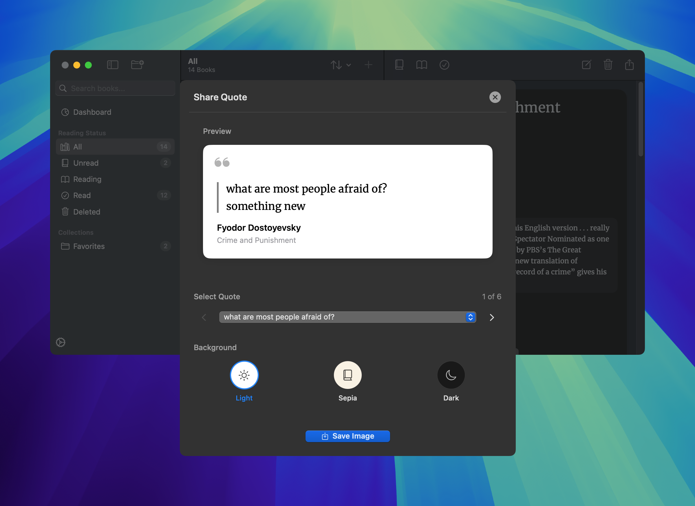

    
    <h1>Inkwell</h1>

Inkwell (formerly reader) is a simple book library and reading tracker app for macOS, designed and developed in Swift. It was purposefully built for personal use and to share with a friend, making it easier to manage book collections and track reading progress.

## Dependencies

- [Fuse](https://github.com/krisk/fuse-swift)
- [SwiftCSV](https://github.com/swiftcsv/SwiftCSV)

## Features

- Tag books
- Rate read books out of 5 stars
- Search through your added books
- Save excerpts in the quotes section
- See your reading statistics in the dashboard
- Import/export books to/from `CSV` or `JSON`
- Track reading statuses: unread, reading, or read
- Create collections and organize books into them
- Filter books by reading status, tags, or collections
- Jot down thoughts or annotations in a dedicated notes section
- Save quotes as an image in three different styles: light, sepia, or dark
- Sort your library by title, author, or published date, in ascending or descending order
- Add books by fetching from Google Books and Open Library, or entering them manually

## Screenshots

## Install

- Download the `Inkwell-x.y.z.zip` file from the [latest release](https://github.com/chippokiddo/reader/releases/latest)
- Unzip the file and move `Inkwell.app` into your `Applications` folder
- Control-click or right-click the app and select 'open'

> [!NOTE]
> Since Inkwell is not notarized, macOS Gatekeeper may block the app:
>
> - Go to System Settings > Privacy & Security
> - Scroll down and locate the prompt for `Inkwell.app`
> - Click 'open anyway'
>
> The app requires network access to fetch book data via the Google Books API and Open Library

## Contribute

Contributions are welcome! Follow these steps to contribute:

1. Fork the repository
2. Create a branch with your feature or bug fix
3. Submit a pull request for review

## Translate

You can help make this app more accessible by contributing translations! This project uses Xcode's string catalogs `Localizable.xcstrings` for localization. To learn how to edit or add translations, refer to [Apple's official documentation](https://developer.apple.com/documentation/xcode/localizing-and-varying-text-with-a-string-catalog).

## Acknowledgements

This application uses the [Merriweather font](https://fonts.google.com/specimen/Merriweather), made available under the [Open Font License](../reader/Merriweather/OFL.txt).
