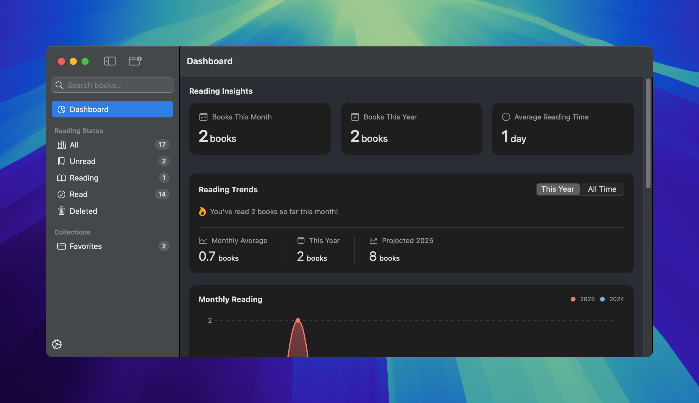

<div align="center">
    
    <h1>reader</h1>
</div>


[](https://github.com/chippokiddo/reader/releases/latest)

[](../LICENSE)

reader is a simple book library and reading tracker app for macOS, designed and developed in Swift. It was purposefully built for personal use and to share with a friend, making it easier to manage book collections and track reading progress.



## Features

- Add and organize books in your personal library
- Notes section: jot down thoughts or annotations
- Quotes section: save memorable excerpts
- Track reading statuses: unread, reading, or read
- Sort, search, or filter your personal library with ease

## Screenshots

<figure>
    
    <figcaption>reader in light mode</figcaption>
</figure>

## Permissions

reader requires network access to fetch book data via the Google Books API.

## Install

- Download the `reader.zip` file from the [latest release](https://github.com/chippokiddo/reader/releases/latest)
- Unzip the file and move `reader.app` into your `Applications` folder
- Control-click or right-click the app and select 'open'

> [!NOTE]
> Since reader is not notarized, macOS Gatekeeper may block the app:
>
> - Go to System Settings > Privacy & Security
> - Scroll down and locate the prompt for `reader.app`
> - Click 'open anyway'

## Compiling reader

If you'd like to compile the app yourself, follow these steps:

1. Open Terminal and run:

   ```bash
   git clone https://github.com/chippokiddo/reader.git
   cd reader
   ```

2. Create a New Xcode Project

   - Open Xcode
   - Select 'create a new Xcode project'
   - Choose 'app' under the macOS tab and click 'next'
   - Enter the following details:
     - Product Name: `reader`
   - Set the language to Swift and user interface to SwiftUI
   - Choose a location to save the project

> [!IMPORTANT]
>
> Make sure you're running macOS 14 or higher and have Xcode 16 or later installed, since the project uses Swift 6

3. Locate the cloned repository and open the `reader` directory in Finder

4. Drag and drop the following folders and files into your Xcode project:

   ```
   .
   └── reader/
       ├── Assets.xcassets
       ├── Configurations
       ├── ContentView.swift
       ├── Helpers
       ├── Info.plist
       ├── Merriweather
       ├── Models
       ├── Preview Content
       ├── reader.entitlements
       ├── Subviews
       ├── Utils
       └── Views
   ```

5. Add Your Google Books API Key

   - The app uses the Google Books API to fetch book data. You need to provide your own API key for the app to function

   - Locate the file `Config.xcconfig.template` in the repository

   - Rename it to `Config.xcconfig`

   - Open the `Config.xcconfig` file and replace the placeholder with your actual Google Books API key:

     ```
     GOOGLE_BOOKS_API_KEY=your_actual_api_key
     ```

   - Save the file. Xcode will automatically use this key during the build process

   - If the `Config.xcconfig` file is not automatically detected, assign it to your build configurations:

     - In Xcode, open the info tab for the reader project
     - Under configurations, link the `Config.xcconfig` file to both debug and release builds

6. Configure Signing to Run Locally

   - In Xcode, go to Signing & Capabilities tab for the `reader` target.

   - Set the team dropdown to 'none'

   - Set the signing certificate to Sign to Run Locally

7. Build and Run the App

   - Press `⌘ + R` to build and run the app on your Mac

8. Archive the App for Independent Use

   If you want to run the app without Xcode:

   - In Xcode, go to Product > Archive from the menu bar
   - Once the archiving process completes, the organizer window will appear
   - Select the latest build and click Distribute App
   - In the popup that appears, click 'custom,' then click 'next' in the bottom right of the popup
   - Click 'copy app'
   - Once completed, you’ll see `reader.app` in a folder where you saved it. Drag reader to your Applications folder, and you're done!

> [!WARNING]
>
> reader is licensed under the GNU General Public License v3 (GPLv3). This means:
>
> - Any modifications to the source code must also be distributed under GPLv3.
> - If you share a modified version of this app, you must include the source code for your modifications.
> - For more details, refer to the [GPLv3 License Terms](../LICENSE).

## Contribute

Contributions are welcome! Follow these steps to contribute:

1. Fork the repository
2. Create a branch with your feature or bug fix
3. Submit a pull request for review

## Acknowledgements

reader uses the [Merriweather font](https://fonts.google.com/specimen/Merriweather), made available under the [Open Font License](../reader/Merriweather/OFL.txt).
